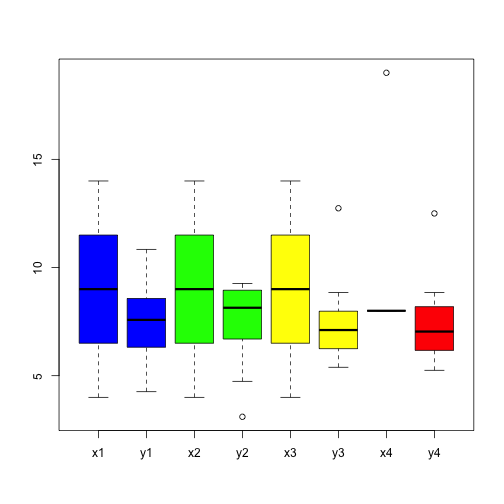
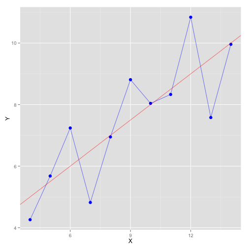
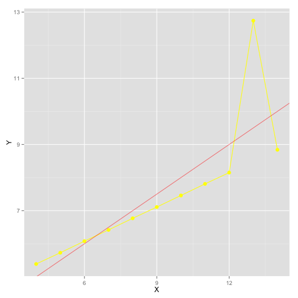
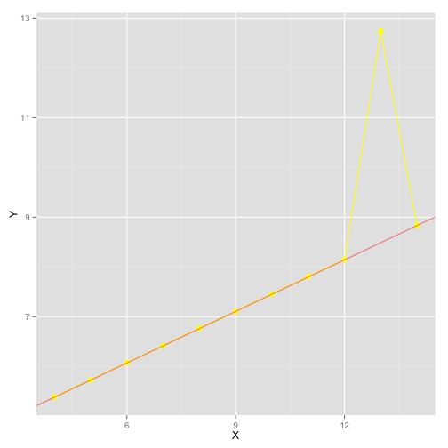
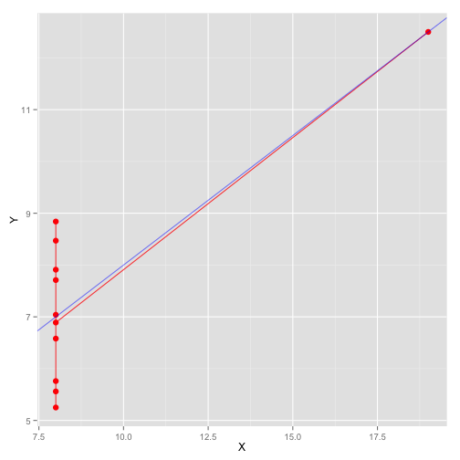
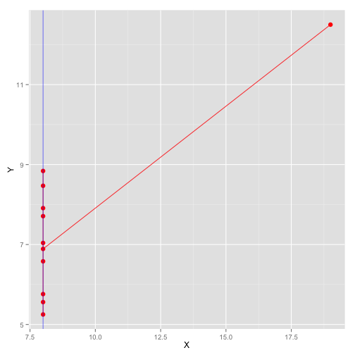

* * *
## IS607 - Project 2
### Seoungyoon Lim(Nathan Lim)

* * *

## Table of Contents
* [Overview](#Overview)
* [Set 1](#Set 1)
* [Set 2](#Set 2)
* [Set 3](#Set 3)
* [Set 4](#Set 4)
* [Conclusion](#Conclusion)

* * *

## <a name="Overview"></a>Overview

The data has 4 sets of variables, which have x and y variables each. I have changed these variables to (x1, y1),...,(x4,y4)

 

The summary and the boxplot above show us that although x1, x2, x3 have the same values but x4 has a big outlier. The y values lay on between 3.1 and 12.74 and some of them have outliers.


* * *

## <a name="Set 1"></a>Set 1

The ggplot of X1,Y1 and an abline

```r
coef(lm(y1 ~ x1, data = data))
```

```
## (Intercept)          x1 
##   3.0000909   0.5000909
```

```r
ggplot(data, aes(x=X, y=Y))+
        geom_point(aes(x=x1,y=y1, color="x1"), size=3, col="blue")+
        geom_line(aes(x=x1,y=y1, color="x1"),alpha=0.5,col="blue")+geom_abline(intercept=3.0, slope=0.5, color="red", alpha=0.5)
```

 

This plot is fluctuating but it is roughly increasing. This kind of plots can be seen in economic development, or stock markets.

* * *


## <a name="Set 2"></a>Set 2
The ggplot of X2,Y2 and an abline

```r
coef(lm(y2 ~ x2, data = data))
```

```
## (Intercept)          x2 
##    3.000909    0.500000
```

```r
ggplot(data, aes(x=X, y=Y))+
        geom_point(aes(x=x2,y=y2, color="x2"), size=3, col="green")+
        geom_line(aes(x=x2,y=y2, color="x2"), col="green")+geom_abline(intercept=3.0, slope=0.5, color="red", alpha=0.5)
```

 

This plot is increasing at first, and the rate of increasing is reduced, and then the y value decreased at the same shape it has increased.
The abline is hard to be seen that it explains the plot. The plot itself explains the pattern of data.

* * *


## <a name="Set 3"></a>Set 3
The ggplot of X3,Y3 and I added an abline

```r
coef(lm(y3 ~ x3, data = data))
```

```
## (Intercept)          x3 
##   3.0024545   0.4997273
```

```r
ggplot(data, aes(x=X, y=Y))+
        geom_point(aes(x=x3,y=y3, color="x3"),size=3, col="yellow")+
        geom_line(aes(x=x3,y=y3, color="x3"), col="yellow")+geom_abline(intercept=3.0, slope=0.5, color="red", alpha=0.5)
```

 

This plot shows continous increasing except one outlier. Because of one outlier, the other values can not be on the abline. So, I redrew an abline excluding the outlier.


```r
data3<-filter(data, y3<11)
coef(lm(y3 ~ x3, data = data3))
```

```
## (Intercept)          x3 
##   4.0056494   0.3453896
```

```r
ggplot(data, aes(x=X, y=Y))+
        geom_point(aes(x=x3,y=y3, color="x3"),size=3, col="yellow")+
        geom_line(aes(x=x3,y=y3, color="x3"), col="yellow")+geom_abline(intercept=4.0, slope=0.3453, color="red", alpha=0.5)
```

 

Now, we can see that except the outlier, all the values are very near the abline.

* * *


## <a name="Set 4"></a>Set 4
The ggplot of X4,Y4 and I added an abline

```r
coef(lm(y4 ~ x4, data = data))
```

```
## (Intercept)          x4 
##   3.0017273   0.4999091
```

```r
ggplot(data, aes(x=X, y=Y))+
        geom_point(aes(x=x4,y=y4, color="x4"), size=3, col="red")+
        geom_line(aes(x=x4,y=y4, color="x4"),alpha=0.8, col="red")+geom_abline(intercept=3.0, slope=0.5, color="blue", alpha=0.5)
```

 

But, this abline is hard to be said that it explain the plot well. Because of one-far-away outlier, it is distorted. So, I redrew an abline excluding the outlier.


```r
ggplot(data, aes(x=X, y=Y))+
        geom_point(aes(x=x4,y=y4, color="x4"), size=3, col="red")+
        geom_line(aes(x=x4,y=y4, color="x4"),alpha=0.8, col="red")+geom_vline(x=8, color="blue", alpha=0.5)
```

 

Now, we can see that except the outlier, all the values are very near the abline.

* * *

## <a name="Conclusion"></a>Conclusion

Each dataset shows typical patterns. Especially, excluding the outliers, the 2nd, 3rd and 4th sets have theoritical relations between x and y. Handling outlier is always challenging. It should be handled with much care, since it affects on variety of stats a lot. In the 3rd and 4th set, I excluded outliers to get an more plausible abline. However, I did not do that in 2nd case because even if the boxplot shows the outlier, it is hard to believe that it has an outlier.

* * *
