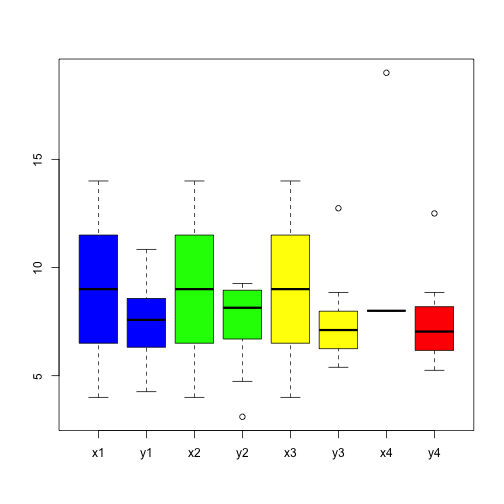
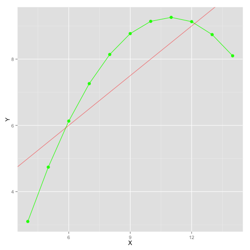
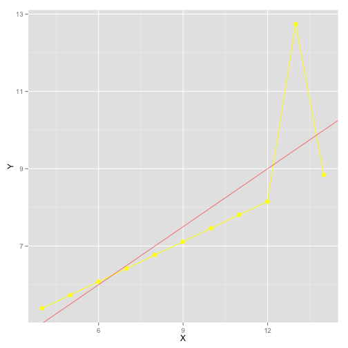
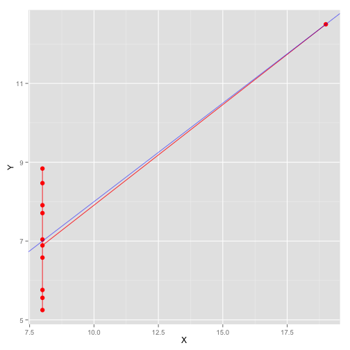

* * *
## IS607 - Project 2
### Seoungyoon Lim(Nathan Lim)

* * *

## Table of Contents
* [Overview](#Overview)
* [Set 1](#Set 1)
* [Set 2](#Set 2)
* [Set 3](#Set 3)
* [Set 4](#Set 4)
* [Conclusion](#Conclusion)

* * *

## <a name="Overview"></a>Overview

The data has 4 sets of variables, which have x and y variables each.


```r
library(ggplot2)
library(dplyr)
```

```
## 
## Attaching package: 'dplyr'
## 
## The following object is masked from 'package:stats':
## 
##     filter
## 
## The following objects are masked from 'package:base':
## 
##     intersect, setdiff, setequal, union
```

```r
data<-read.csv("/Users/seoungyoonlim/Documents/cuny/IS607/project2/pro2.csv", header=T)
data$set  <- as.factor(data$set)
str(data)
```

```
## 'data.frame':	44 obs. of  3 variables:
##  $ x  : num  10 8 13 9 11 14 6 4 12 7 ...
##  $ y  : num  8.04 6.95 7.58 8.81 8.33 ...
##  $ set: Factor w/ 4 levels "1","2","3","4": 1 1 1 1 1 1 1 1 1 1 ...
```

```r
#check primary stats of each dataset
summary(data[which(data$set == '1'),])
```

```
##        x              y          set   
##  Min.   : 4.0   Min.   : 4.260   1:11  
##  1st Qu.: 6.5   1st Qu.: 6.315   2: 0  
##  Median : 9.0   Median : 7.580   3: 0  
##  Mean   : 9.0   Mean   : 7.501   4: 0  
##  3rd Qu.:11.5   3rd Qu.: 8.570         
##  Max.   :14.0   Max.   :10.840
```

```r
summary(data[which(data$set == '2'),])
```

```
##        x              y         set   
##  Min.   : 4.0   Min.   :3.100   1: 0  
##  1st Qu.: 6.5   1st Qu.:6.695   2:11  
##  Median : 9.0   Median :8.140   3: 0  
##  Mean   : 9.0   Mean   :7.501   4: 0  
##  3rd Qu.:11.5   3rd Qu.:8.950         
##  Max.   :14.0   Max.   :9.260
```

```r
summary(data[which(data$set == '3'),])
```

```
##        x              y         set   
##  Min.   : 4.0   Min.   : 5.39   1: 0  
##  1st Qu.: 6.5   1st Qu.: 6.25   2: 0  
##  Median : 9.0   Median : 7.11   3:11  
##  Mean   : 9.0   Mean   : 7.50   4: 0  
##  3rd Qu.:11.5   3rd Qu.: 7.98         
##  Max.   :14.0   Max.   :12.74
```

```r
summary(data[which(data$set == '4'),])
```

```
##        x            y          set   
##  Min.   : 8   Min.   : 5.250   1: 0  
##  1st Qu.: 8   1st Qu.: 6.170   2: 0  
##  Median : 8   Median : 7.040   3: 0  
##  Mean   : 9   Mean   : 7.501   4:11  
##  3rd Qu.: 8   3rd Qu.: 8.190         
##  Max.   :19   Max.   :12.500
```

```r
summary(data$x(which), by=set, summary) 
```

```
## Error in summary(data$x(which), by = set, summary): attempt to apply non-function
```

```r
ggplot(data, aes(x,y))+geom_point()+facet_grid(set~.)+geom_line()
```

 
The summary and the plot above show us that each of dataset has a some pattern. But set3 and set4 have a big outlier.


* * *

## <a name="Set 1"></a>Set 1

The ggplot of the first data set and an abline

```r
set1 <- data[which(data$set == '1'),]
coef(lm(y ~ x, data = set1))
```

```
## (Intercept)           x 
##   3.0000909   0.5000909
```

```r
ggplot(set1, aes(x=x, y=y))+
        geom_point(size=3, col="blue")+
        geom_line(aes(x, y),alpha=0.5,col="blue")+geom_abline(intercept=3.0, slope=0.5, color="red", alpha=0.5)+ggtitle("Data Set1")+theme(plot.title = element_text(face="bold"))
```

 

This plot is fluctuating but it is roughly increasing. This kind of plots can be seen in economic development, or stock markets.

* * *


## <a name="Set 2"></a>Set 2
The ggplot of the second data set and an abline

```r
set2 <- data[which(data$set == '2'),]
coef(lm(y ~ x, data = set2))
```

```
## (Intercept)           x 
##    3.000909    0.500000
```

```r
ggplot(set2, aes(x=x, y=y))+geom_point(size=3, col="green")+
        geom_line(aes(x, y), col="green")+geom_abline(intercept=3.0, slope=0.5, color="red", alpha=0.5)+ggtitle("Data Set2")+theme(plot.title = element_text(face="bold"))
```

 

This plot is increasing at first, and the rate of increasing is reduced, and then the y value decreased at the same shape it has increased.
The abline is hard to be seen that it explains the plot well. The plot itself explains the pattern of data well.


```r
ggplot(set2, aes(x, y))+geom_point(size=3, col="green")+geom_smooth(method="loess",se=F, size=0.2, color="red")+ggtitle("Data Set2")+theme(plot.title = element_text(face="bold"))
```

 

* * *


## <a name="Set 3"></a>Set 3
The ggplot of the third data set and an abline

```r
set3 <- data[which(data$set == '3'),]
coef(lm(y ~ x, data = set3))
```

```
## (Intercept)           x 
##   3.0024545   0.4997273
```

```r
ggplot(set3, aes(x, y))+
        geom_point(size=3, col="yellow")+
        geom_line(col="yellow")+geom_abline(intercept=3.0, slope=0.5, color="red", alpha=0.5)+ggtitle("Data Set3")+theme(plot.title = element_text(face="bold"))
```

 

This plot shows continous increasing except one outlier. Because of one outlier, the other values can not be on the abline. So, I redrew an abline excluding the outlier.


```r
set3new<-filter(set3, y<11)
coef(lm(y ~ x, data = set3new))
```

```
## (Intercept)           x 
##   4.0056494   0.3453896
```

```r
ggplot(set3, aes(x, y))+
        geom_point(size=3, col="yellow")+
        geom_line(col="yellow")+geom_abline(intercept=4.0, slope=0.3453, color="red", alpha=0.5)+ggtitle("Data Set3")+theme(plot.title = element_text(face="bold"))
```

 

Now, we can say that all the values are very near the abline but the outlier.

* * *


## <a name="Set 4"></a>Set 4
The ggplot of the fourth data set and an abline

```r
set4 <- data[which(data$set == '4'),]
coef(lm(y ~ x, data = set4))
```

```
## (Intercept)           x 
##   3.0017273   0.4999091
```

```r
ggplot(set4, aes(x, y))+
        geom_point(size=3, col="purple")+
        geom_line(alpha=0.8, col="purple")+geom_abline(intercept=3.0, slope=0.5, color="red" )+ggtitle("Data Set4")+theme(plot.title = element_text(face="bold"))
```

 

But, this abline is hard to be said that it explain the plot well. Because of one-far-away outlier, it is distorted. So, I redrew an abline excluding the outlier.


```r
ggplot(set4, aes(x, y))+
        geom_point(size=3, col="purple")+
        geom_line(alpha=0.8, col="purple")+geom_vline(x=8, color="red", alpha=0.5)+ggtitle("Data Set4")+theme(plot.title = element_text(face="bold"))
```

 

Now, we can see that except the outlier, all the values are very near the abline.

* * *

## <a name="Conclusion"></a>Conclusion

Each dataset shows typical patterns. Especially, after excluding the outliers, the 2nd, 3rd and 4th sets have theoritical relations between x and y. In the 3rd and 4th set, I excluded outliers to get an more plausible abline. However, I did not do that in the 2nd case because even if the boxplot shows the outlier, it is hard to say that it is an outlier. Instead of that I found a square function which is believed to explain the plot well. Handling outlier is always challenging. It should be handled with much care, since it affects on variety of stats a lot.


* * *
