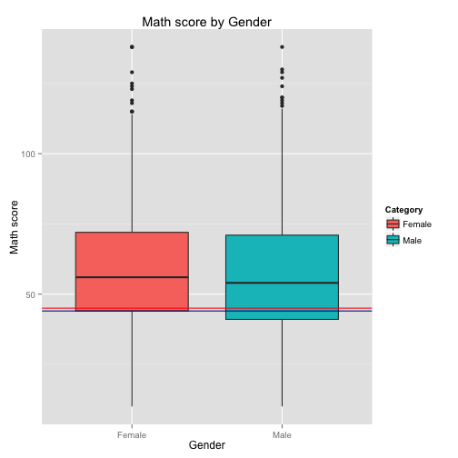
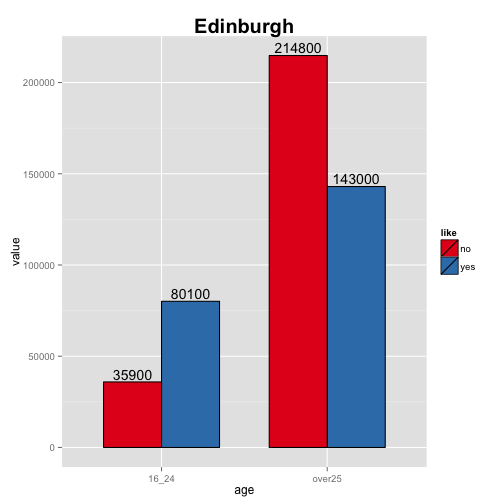
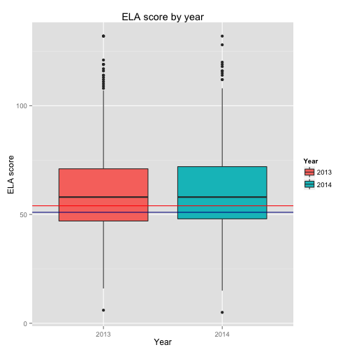
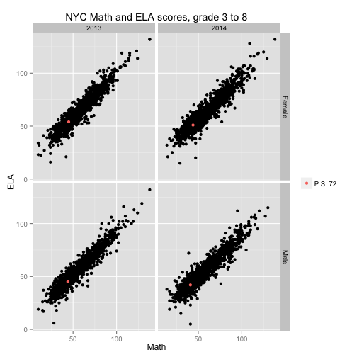

* * *
## IS607 - Week6
### Seoungyoon Lim(Nathan Lim)

* * *

## Table of Contents
* [Background](#Background)
* [Math score](#Math score)
* [ELA score](#ELA score)
* [Corelation](#Corelation)
* [Conclusion](#Conclusion)

* * *
## <a name="Background"></a>Background

To assess NYC schools, NYC department of education has schools in the city take a math and ELA test. I would like to look through these scores and compare this with a certain school(Catherine and Count Basie middle school, PS72)'s score.
For this analysis, I have downloaded 2013~2014 math and ELA score files from a NYC Department of Education web page.


```r
library(ggplot2)

math_gender <- read.csv(file="/Users/seoungyoonlim/Documents/cuny/IS607/week6/math_gender.csv",header=T)

#1. Identify which variables in your data set are numeric, and which are categorical (factors). Change Year,Category variables From integer to Factor and Change Mean.Scale.Score From Factor to numeric
str(math_gender)
```

```
## 'data.frame':	19034 obs. of  6 variables:
##  $ School.Name     : Factor w/ 1135 levels "A.C.E. ACADEMY FOR SCHOLARS AT THE GERALDINE FERRARO CAMPUS",..: 373 373 373 373 373 373 373 373 373 373 ...
##  $ Grade           : Factor w/ 7 levels "3","4","5","6",..: 1 1 1 1 2 2 2 2 3 3 ...
##  $ Year            : int  2013 2013 2014 2014 2013 2013 2014 2014 2013 2013 ...
##  $ Category        : Factor w/ 2 levels "Female","Male": 1 2 1 2 1 2 1 2 1 2 ...
##  $ Number.Tested   : int  12 15 13 5 12 8 9 15 11 13 ...
##  $ Mean.Scale.Score: Factor w/ 138 levels "232","238","243",..: 34 41 40 138 29 50 45 41 31 37 ...
```

```r
math_gender$Year<-as.factor(math_gender$Year)
math_gender$Category<-as.factor(math_gender$Category)
math_gender$Mean.Scale.Score<-as.numeric(math_gender$Mean.Scale.Score)

#Make table that has only PS 72 school's math result
ps72<-math_gender[grep('BASIE', math_gender[,1]),]
ps72
```

```
##                                    School.Name      Grade Year Category
## 16063 CATHERINE & COUNT BASIE MIDDLE SCHOOL 72          6 2013   Female
## 16064 CATHERINE & COUNT BASIE MIDDLE SCHOOL 72          6 2013     Male
## 16065 CATHERINE & COUNT BASIE MIDDLE SCHOOL 72          6 2014   Female
## 16066 CATHERINE & COUNT BASIE MIDDLE SCHOOL 72          6 2014     Male
## 16067 CATHERINE & COUNT BASIE MIDDLE SCHOOL 72          7 2013   Female
## 16068 CATHERINE & COUNT BASIE MIDDLE SCHOOL 72          7 2013     Male
## 16069 CATHERINE & COUNT BASIE MIDDLE SCHOOL 72          7 2014   Female
## 16070 CATHERINE & COUNT BASIE MIDDLE SCHOOL 72          7 2014     Male
## 16071 CATHERINE & COUNT BASIE MIDDLE SCHOOL 72          8 2013   Female
## 16072 CATHERINE & COUNT BASIE MIDDLE SCHOOL 72          8 2013     Male
## 16073 CATHERINE & COUNT BASIE MIDDLE SCHOOL 72          8 2014   Female
## 16074 CATHERINE & COUNT BASIE MIDDLE SCHOOL 72          8 2014     Male
## 16075 CATHERINE & COUNT BASIE MIDDLE SCHOOL 72 All Grades 2013   Female
## 16076 CATHERINE & COUNT BASIE MIDDLE SCHOOL 72 All Grades 2013     Male
## 16077 CATHERINE & COUNT BASIE MIDDLE SCHOOL 72 All Grades 2014   Female
## 16078 CATHERINE & COUNT BASIE MIDDLE SCHOOL 72 All Grades 2014     Male
##       Number.Tested Mean.Scale.Score
## 16063           138               50
## 16064           139               42
## 16065           120               49
## 16066           127               43
## 16067           140               45
## 16068           174               47
## 16069           139               47
## 16070           147               41
## 16071           123               41
## 16072           133               42
## 16073           125               36
## 16074           158               39
## 16075           401               45
## 16076           446               44
## 16077           384               44
## 16078           432               41
```

```r
ps72_all<-ps72[grep('All', ps72[,2]),]
ps72_all
```

```
##                                    School.Name      Grade Year Category
## 16075 CATHERINE & COUNT BASIE MIDDLE SCHOOL 72 All Grades 2013   Female
## 16076 CATHERINE & COUNT BASIE MIDDLE SCHOOL 72 All Grades 2013     Male
## 16077 CATHERINE & COUNT BASIE MIDDLE SCHOOL 72 All Grades 2014   Female
## 16078 CATHERINE & COUNT BASIE MIDDLE SCHOOL 72 All Grades 2014     Male
##       Number.Tested Mean.Scale.Score
## 16075           401               45
## 16076           446               44
## 16077           384               44
## 16078           432               41
```

```r
#Make table that has total numbers of each school
math_g_all<-math_gender[grep('All', math_gender[,2]),]
head(math_g_all)
```

```
##                  School.Name      Grade Year Category Number.Tested
## 13 P.S. 015 ROBERTO CLEMENTE All Grades 2013   Female            35
## 14 P.S. 015 ROBERTO CLEMENTE All Grades 2013     Male            36
## 15 P.S. 015 ROBERTO CLEMENTE All Grades 2014   Female            34
## 16 P.S. 015 ROBERTO CLEMENTE All Grades 2014     Male            29
## 29       P.S. 019 ASHER LEVY All Grades 2013   Female            54
## 30       P.S. 019 ASHER LEVY All Grades 2013     Male            60
##    Mean.Scale.Score
## 13               31
## 14               41
## 15               33
## 16               44
## 29               60
## 30               61
```

```r
#2. Generate summary level descriptive statistics
summary(math_g_all[which(math_g_all$Year==2013),6])
```

```
##    Min. 1st Qu.  Median    Mean 3rd Qu.    Max. 
##   10.00   42.00   53.00   56.33   69.00  138.00
```

```r
summary(ps72_all[which(ps72_all$Year==2013),6])
```

```
##    Min. 1st Qu.  Median    Mean 3rd Qu.    Max. 
##   44.00   44.25   44.50   44.50   44.75   45.00
```

```r
summary(math_g_all[which(math_g_all$Year==2014),6])
```

```
##    Min. 1st Qu.  Median    Mean 3rd Qu.    Max. 
##   14.00   44.00   57.00   59.42   74.00  138.00
```

```r
summary(ps72_all[which(ps72_all$Year==2014),6])
```

```
##    Min. 1st Qu.  Median    Mean 3rd Qu.    Max. 
##   41.00   41.75   42.50   42.50   43.25   44.00
```

```r
#3. Determine the frequency for one of the categorical variables.
table(math_g_all$Category)
```

```
## 
## Female   Male 
##   2228   2221
```

```r
#4. Determine the frequency two categorical variables
table(math_g_all$Category, math_g_all$Year)
```

```
##         
##          2013 2014
##   Female 1104 1124
##   Male   1100 1121
```


The differences between mean of NYC average and mean of the school are 11.83 points(2013) and  16.92(2014).
The gap between the school's average and NYC average has increased.

* * *
## <a name="Math score"></a>Math score


```r
##5.Create a graph for a single numeric variable. Draw boxplots by Gender
p1<-qplot(Category, Mean.Scale.Score, data=math_g_all, geom="boxplot", fill=Category, main='Math score by Gender', xlab='Gender', ylab='Math score')
p1+geom_hline(yintercept = c(mean(ps72_all$Mean.Scale.Score[1],
                            ps72_all$Mean.Scale.Score[3]),
                            mean(ps72_all$Mean.Scale.Score[2],
                            ps72_all$Mean.Scale.Score[4]))
             ,color=c("red","darkblue"), label=c("2013","2014"))
```

 

* * *

As we can see above, Female students' math score is a little higher than male students' one. The same trend is shown in ps 72 school. But, while the school's female score are around at 1st quantile, boy's score are over the 1st quantile of NYC boy's math boxplot. 

* * *


```r
#Draw boxplots by Year
p2<-qplot(Year, Mean.Scale.Score, data=math_g_all, fill=Year, geom="boxplot", main='Math score by year', xlab='Year', ylab='Math score')
p2+geom_hline(yintercept = c(mean(ps72_all$Mean.Scale.Score[1],
                            ps72_all$Mean.Scale.Score[2]),
                            mean(ps72_all$Mean.Scale.Score[3],
                            ps72_all$Mean.Scale.Score[4]))
             ,color=c("red","darkblue"), label=c("2013","2014"))
```

 

The above boxplot shows that the variance of math scores of 2013 and 2014. The absolute scores are not meaningful, since the difficulties of two tests are different. But we can see that the score of NYC students has increased, though, the score of PS72 has decreased.

* * *

## <a name="ELA score"></a>ELA score

Now I would like to see ELA scores.


```r
ela<- read.csv(file="/Users/seoungyoonlim/Documents/cuny/IS607/week6/ELA.csv",header=T)
str(ela)
```

```
## 'data.frame':	19065 obs. of  6 variables:
##  $ School.Name     : Factor w/ 1135 levels "A.C.E. ACADEMY FOR SCHOLARS AT THE GERALDINE FERRARO CAMPUS",..: 373 373 373 373 373 373 373 373 373 373 ...
##  $ Grade           : Factor w/ 7 levels "3","4","5","6",..: 1 1 1 1 2 2 2 2 3 3 ...
##  $ Year            : int  2013 2013 2014 2014 2013 2013 2014 2014 2013 2013 ...
##  $ Category        : Factor w/ 2 levels "Female","Male": 1 2 1 2 1 2 1 2 1 2 ...
##  $ Number.Tested   : int  12 15 13 5 12 8 9 15 11 13 ...
##  $ Mean.Scale.Score: Factor w/ 132 levels "228","233","236",..: 50 57 47 132 48 34 48 49 52 47 ...
```

```r
#1. Identify which variables in your data set are numeric, and which are categorical (factors). Change Year,Category variables From integer to Factor and Change Mean.Scale.Score From Factor to numeric
ela$Year<-as.factor(ela$Year)
ela$Category<-as.factor(ela$Category)
ela$Mean.Scale.Score<-as.numeric(ela$Mean.Scale.Score)

#Make table that has only PS 72 school's ELA result
ps72_ela<-ela[grep('BASIE', ela[,1]),]
ps72_ela
```

```
##                                    School.Name      Grade Year Category
## 16089 CATHERINE & COUNT BASIE MIDDLE SCHOOL 72          6 2013   Female
## 16090 CATHERINE & COUNT BASIE MIDDLE SCHOOL 72          6 2013     Male
## 16091 CATHERINE & COUNT BASIE MIDDLE SCHOOL 72          6 2014   Female
## 16092 CATHERINE & COUNT BASIE MIDDLE SCHOOL 72          6 2014     Male
## 16093 CATHERINE & COUNT BASIE MIDDLE SCHOOL 72          7 2013   Female
## 16094 CATHERINE & COUNT BASIE MIDDLE SCHOOL 72          7 2013     Male
## 16095 CATHERINE & COUNT BASIE MIDDLE SCHOOL 72          7 2014   Female
## 16096 CATHERINE & COUNT BASIE MIDDLE SCHOOL 72          7 2014     Male
## 16097 CATHERINE & COUNT BASIE MIDDLE SCHOOL 72          8 2013   Female
## 16098 CATHERINE & COUNT BASIE MIDDLE SCHOOL 72          8 2013     Male
## 16099 CATHERINE & COUNT BASIE MIDDLE SCHOOL 72          8 2014   Female
## 16100 CATHERINE & COUNT BASIE MIDDLE SCHOOL 72          8 2014     Male
## 16101 CATHERINE & COUNT BASIE MIDDLE SCHOOL 72 All Grades 2013   Female
## 16102 CATHERINE & COUNT BASIE MIDDLE SCHOOL 72 All Grades 2013     Male
## 16103 CATHERINE & COUNT BASIE MIDDLE SCHOOL 72 All Grades 2014   Female
## 16104 CATHERINE & COUNT BASIE MIDDLE SCHOOL 72 All Grades 2014     Male
##       Number.Tested Mean.Scale.Score
## 16089           136               57
## 16090           136               39
## 16091           119               50
## 16092           129               43
## 16093           141               52
## 16094           174               48
## 16095           134               56
## 16096           148               37
## 16097           122               51
## 16098           132               48
## 16099           137               48
## 16100           173               45
## 16101           399               54
## 16102           442               45
## 16103           390               51
## 16104           450               42
```

```r
ps72_ela_all<-ps72_ela[grep('All', ps72_ela[,2]),]
ps72_ela_all
```

```
##                                    School.Name      Grade Year Category
## 16101 CATHERINE & COUNT BASIE MIDDLE SCHOOL 72 All Grades 2013   Female
## 16102 CATHERINE & COUNT BASIE MIDDLE SCHOOL 72 All Grades 2013     Male
## 16103 CATHERINE & COUNT BASIE MIDDLE SCHOOL 72 All Grades 2014   Female
## 16104 CATHERINE & COUNT BASIE MIDDLE SCHOOL 72 All Grades 2014     Male
##       Number.Tested Mean.Scale.Score
## 16101           399               54
## 16102           442               45
## 16103           390               51
## 16104           450               42
```

```r
#Make table that has total numbers of each school
ela_all<-ela[grep('All', ela[,2]),]
head(ela_all)
```

```
##                  School.Name      Grade Year Category Number.Tested
## 13 P.S. 015 ROBERTO CLEMENTE All Grades 2013   Female            35
## 14 P.S. 015 ROBERTO CLEMENTE All Grades 2013     Male            36
## 15 P.S. 015 ROBERTO CLEMENTE All Grades 2014   Female            34
## 16 P.S. 015 ROBERTO CLEMENTE All Grades 2014     Male            29
## 29       P.S. 019 ASHER LEVY All Grades 2013   Female            53
## 30       P.S. 019 ASHER LEVY All Grades 2013     Male            59
##    Mean.Scale.Score
## 13               50
## 14               48
## 15               41
## 16               48
## 29               68
## 30               55
```

```r
#2. Generate summary level descriptive statistics
summary(ela_all[which(ela_all$Year==2013),6])
```

```
##    Min. 1st Qu.  Median    Mean 3rd Qu.    Max. 
##    6.00   47.00   58.00   60.12   71.00  132.00
```

```r
summary(ps72_ela_all[which(ps72_ela_all$Year==2013),6])
```

```
##    Min. 1st Qu.  Median    Mean 3rd Qu.    Max. 
##   45.00   47.25   49.50   49.50   51.75   54.00
```

```r
summary(ela_all[which(ela_all$Year==2014),6])
```

```
##    Min. 1st Qu.  Median    Mean 3rd Qu.    Max. 
##    5.00   48.00   58.00   60.21   72.00  132.00
```

```r
summary(ps72_ela_all[which(ps72_ela_all$Year==2014),6])
```

```
##    Min. 1st Qu.  Median    Mean 3rd Qu.    Max. 
##   42.00   44.25   46.50   46.50   48.75   51.00
```


The differences between mean of NYC average and mean of the school are 10.62 points(2013) and  13.62(2014).
The gap between the school's average and NYC average has increased.

* * *


```r
#Draw boxplots by Gender
p3<-qplot(Category, Mean.Scale.Score, data=ela_all, geom="boxplot", fill=Category, main='ELA score by Gender', xlab='Gender', ylab='ELA score')
p3+geom_hline(yintercept = c(mean(ps72_ela_all$Mean.Scale.Score[1],
                            ps72_ela_all$Mean.Scale.Score[3]),
                            mean(ps72_ela_all$Mean.Scale.Score[2],
                            ps72_ela_all$Mean.Scale.Score[4]))
             ,color=c("red","darkblue"), label=c("2013","2014"))
```

 


As we can see above, Female students are generally better than male students. The same trend is shown in ps 72 school. The school's both female, male scores are around at 1st quantile of NYC score.

* * *


```r
#Draw boxplots by Year
p4<-qplot(Year, Mean.Scale.Score, data=ela_all, fill=Year, geom="boxplot", main='ELA score by year', xlab='Year', ylab='ELA score')
p4+geom_hline(yintercept = c(mean(ps72_ela_all$Mean.Scale.Score[1],
                            ps72_ela_all$Mean.Scale.Score[2]),
                            mean(ps72_ela_all$Mean.Scale.Score[3],
                            ps72_ela_all$Mean.Scale.Score[4]))
             ,color=c("red","darkblue"), label=c("2013","2014"))
```

 


The above boxplot shows that the variance of ELA scores of 2013 and 2014. The absolute scores are not meaningful, though, two boxplot look almost the same. It implys the difficulties of two tests are not that different but we can see the score of PS72 has decreased.

* * *
## <a name="Corelation"></a>Corelation

Now I would like to check the corelation between Math score and ELA score.

* * *


```r
#6.Create a graph for a two numeric variable
# build a new data including two scores
newdata<-cbind(math_g_all, ela_all$Mean.Scale.Score)
head(newdata)
```

```
##                  School.Name      Grade Year Category Number.Tested
## 13 P.S. 015 ROBERTO CLEMENTE All Grades 2013   Female            35
## 14 P.S. 015 ROBERTO CLEMENTE All Grades 2013     Male            36
## 15 P.S. 015 ROBERTO CLEMENTE All Grades 2014   Female            34
## 16 P.S. 015 ROBERTO CLEMENTE All Grades 2014     Male            29
## 29       P.S. 019 ASHER LEVY All Grades 2013   Female            54
## 30       P.S. 019 ASHER LEVY All Grades 2013     Male            60
##    Mean.Scale.Score ela_all$Mean.Scale.Score
## 13               31                       50
## 14               41                       48
## 15               33                       41
## 16               44                       48
## 29               60                       68
## 30               61                       55
```

```r
names(newdata)[names(newdata)=="ela_all$Mean.Scale.Score"] <- "ela_score"

newps72<-cbind(ps72_all,ps72_ela_all$Mean.Scale.Score)
names(newps72)[names(newps72)=="ps72_ela_all$Mean.Scale.Score"] <- "ela_score"


cor(newdata$Mean.Scale.Score, newdata$ela_score)
```

```
## [1] 0.9191118
```

```r
cor(newps72$Mean.Scale.Score, newps72$ela_score)
```

```
## [1] 0.843274
```

```r
p5<-ggplot(data=newdata,aes(Mean.Scale.Score, ela_score), main='Scatter of math and ELA')+geom_point()+facet_grid(Category~Year)
p5+geom_point(data=newps72,aes(Mean.Scale.Score, ela_score, color='P.S. 72'), )+xlab('Math')+ylab('ELA')+labs(title='NYC Math and ELA scores, grade 3 to 8')+theme(legend.title=element_blank())
```

 


The plot shows the corelation between two scores. we can say that the school that is good at math is normally good at ELA too, or we can say the opposite way. The red dots imply the school position among all NYC schools

* * *

## <a name="Conclusion"></a>Conclusion

The school's math score is around at low 25% of NYC schools, and ELA score is around at low 30% of NYC schools. The level of math test 2014 is a little bit easier than 2013's one, but the school's score has decreased. The level of ELA test 2014 is the almost same 2013's test but the school's ELA score has also decreased.
Female student's scores are higher at both tests. ELA scores has shown this gap significantly.
The same patten is shown at PS 72 scores exactly.
