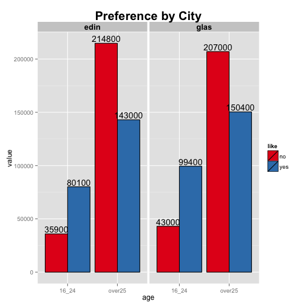
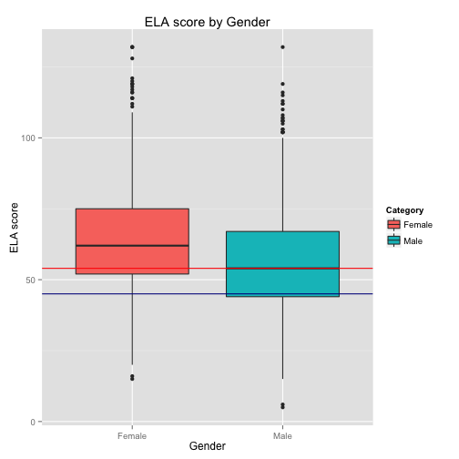
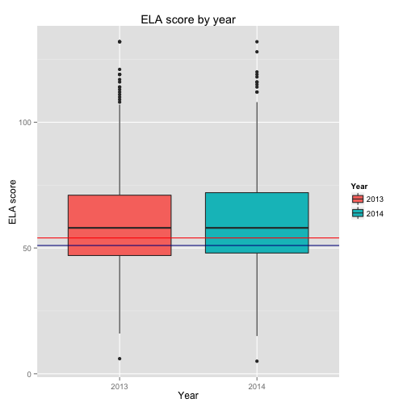
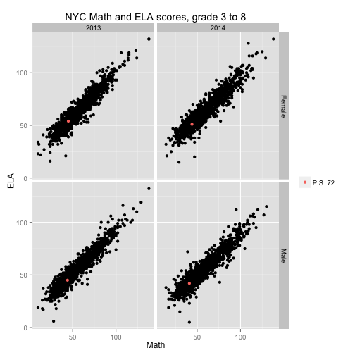

* * *
## IS607 - Week6_1
### Seoungyoon Lim(Nathan Lim)

* * *

## Table of Contents
* [Background](#Background)
* [Math score](#Math score)
* [ELA score](#ELA score)
* [Corelation](#Corelation)
* [Conclusion](#Conclusion)

* * *
## <a name="Background"></a>Background

To assess NYC schools, NYC department of education has schools in the city take a math and ELA test. I would like to look through these scores and compare this with a certain school(Catherine and Count Basie middle school, PS72)'s score.
For this analysis, I have downloaded 2013~2014 math and ELA score files from a NYC Department of Education web page.


* * *
## <a name="Math score"></a>Math score


```r
#2. Generate summary level descriptive statistics
# 2013 math score of NYC schools
summary(math_g_all[which(math_g_all$Year==2013),6])
```

```
##    Min. 1st Qu.  Median    Mean 3rd Qu.    Max. 
##   10.00   42.00   53.00   56.33   69.00  138.00
```

```r
# 2013 math score of PS 72
summary(ps72_all[which(ps72_all$Year==2013),6])
```

```
##    Min. 1st Qu.  Median    Mean 3rd Qu.    Max. 
##   44.00   44.25   44.50   44.50   44.75   45.00
```

```r
# 2014 math score of NYC schools
summary(math_g_all[which(math_g_all$Year==2014),6])
```

```
##    Min. 1st Qu.  Median    Mean 3rd Qu.    Max. 
##   14.00   44.00   57.00   59.42   74.00  138.00
```

```r
# 2014 math score of PS 72
summary(ps72_all[which(ps72_all$Year==2014),6])
```

```
##    Min. 1st Qu.  Median    Mean 3rd Qu.    Max. 
##   41.00   41.75   42.50   42.50   43.25   44.00
```


The differences between mean of NYC average and mean of the school are 11.83 points(2013) and  16.92(2014).
The gap between the school's average and NYC average has increased.


 


As we can see above, Female students' math score is a little higher than male students' one. The same trend is shown in ps 72 school. But, while the school's female score are around at 1st quantile, boy's score are over the 1st quantile of NYC boy's math boxplot. 

* * *

 

The above boxplot shows that the variance of math scores of 2013 and 2014. The absolute scores are not meaningful, since the difficulties of two tests are different. But we can see that the score of NYC students has increased, though, the score of PS72 has decreased.

* * *

## <a name="ELA score"></a>ELA score

Now I would like to see ELA scores.


```r
#2. Generate summary level descriptive statistics

# 2013 ELA of NYC schools
summary(ela_all[which(ela_all$Year==2013),6])
```

```
##    Min. 1st Qu.  Median    Mean 3rd Qu.    Max. 
##    6.00   47.00   58.00   60.12   71.00  132.00
```

```r
# 2013 ELA of PS72
summary(ps72_ela_all[which(ps72_ela_all$Year==2013),6])
```

```
##    Min. 1st Qu.  Median    Mean 3rd Qu.    Max. 
##   45.00   47.25   49.50   49.50   51.75   54.00
```

```r
# 2014 ELA of NYC schools
summary(ela_all[which(ela_all$Year==2014),6])
```

```
##    Min. 1st Qu.  Median    Mean 3rd Qu.    Max. 
##    5.00   48.00   58.00   60.21   72.00  132.00
```

```r
# 2014 ELA of PS72
summary(ps72_ela_all[which(ps72_ela_all$Year==2014),6])
```

```
##    Min. 1st Qu.  Median    Mean 3rd Qu.    Max. 
##   42.00   44.25   46.50   46.50   48.75   51.00
```


The differences between mean of NYC average and mean of the school are 10.62 points(2013) and  13.62(2014).
The gap between the school's average and NYC average has increased.

* * *

 


As we can see above, Female students are generally better than male students. The same trend is shown in ps 72 school. The school's both female, male scores are around at 1st quantile of NYC score.

* * *

 


The above boxplot shows that the variance of ELA scores of 2013 and 2014. The absolute scores are not meaningful, though, two boxplot look almost the same. It implys the difficulties of two tests are not that different but we can see the score of PS72 has decreased.

* * *
## <a name="Corelation"></a>Corelation

Now I would like to check the corelation between Math score and ELA score.


 


The plot shows the corelation between two scores. we can say that the school that is good at math is normally good at ELA too, or we can say the opposite way. The red dots imply the school position among all NYC schools

* * *

## <a name="Conclusion"></a>Conclusion

The school's math score is around at low 25% of NYC schools, and ELA score is around at low 30% of NYC schools. The level of math test 2014 is a little bit easier than 2013's one, but the school's score has decreased. The level of ELA test 2014 is the almost same 2013's test but the school's ELA score has also decreased.
Female student's scores are higher at both tests. ELA scores has shown this gap significantly.
The same patten is shown at PS 72 scores exactly.
