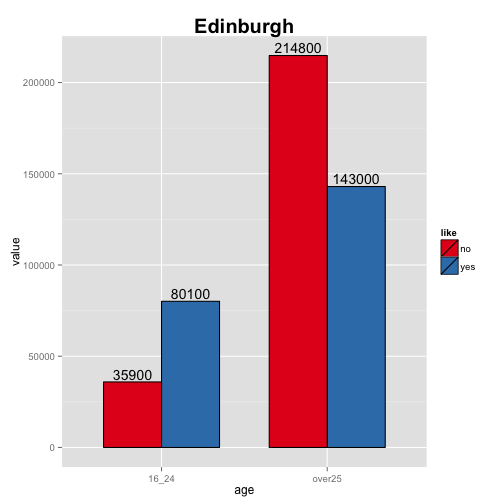
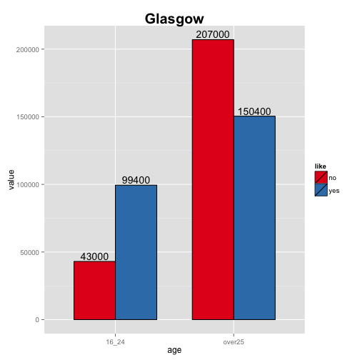
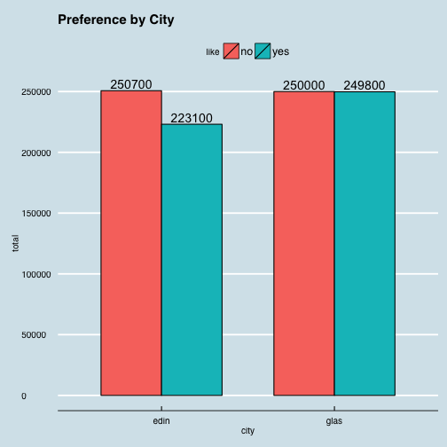

* * *
## IS607 - Week7/8
### Seoungyoon Lim(Nathan Lim)

* * *

## Table of Contents
* [Questions](#Questions)
* [Messy data](#Messy data)
* [Tidy data](#Tidy data)
* [Analysing data](#Analysing data)
* [Answering the questions](#Answering the questions)
* [Conclusion](#Conclusion)

* * *

## <a name="Questions"></a>Questions

1. Which age group shows preference to Cullen skink? How much?
2. Which city shows preference to Cullen skink? How much?
3.


* * *


## <a name="Messy data"></a>Messy data

```r
messy<- read.table(header=T, text="
like edin16_24  edinover25  glas16_24  glasover25
yes  80100 143000 99400 150400
no   35900 214800 43000 207000
                 ")
messy
```

```
##   like edin16_24 edinover25 glas16_24 glasover25
## 1  yes     80100     143000     99400     150400
## 2   no     35900     214800     43000     207000
```

* * *

## <a name="Tidy data"></a>Tidy data

```r
library(tidyr)
library(dplyr)
```

```
## 
## Attaching package: 'dplyr'
## 
## The following object is masked from 'package:stats':
## 
##     filter
## 
## The following objects are masked from 'package:base':
## 
##     intersect, setdiff, setequal, union
```

```r
tidy<-messy %>%
        gather(key, value, edin16_24:glasover25) %>%
        separate(key,c("city", "age"), 4) 

tidy
```

```
##   like city    age  value
## 1  yes edin  16_24  80100
## 2   no edin  16_24  35900
## 3  yes edin over25 143000
## 4   no edin over25 214800
## 5  yes glas  16_24  99400
## 6   no glas  16_24  43000
## 7  yes glas over25 150400
## 8   no glas over25 207000
```

* * *

## <a name="Analysing data"></a>Analysing data


```r
library(ggplot2)
library(dplyr)
edin <- filter(tidy, city=="edin")
glas <- filter(tidy, city=="glas")
lowage <- filter(tidy, age=="16_24")
highage <- filter(tidy, age=="over25")


ggplot(edin, aes(x=age, y=value, ymax = max(value), fill=like))+geom_bar(width=0.7,stat="identity", position="dodge",colour="black") + 
        ggtitle("Edinburgh")+theme(plot.title = element_text(face="bold", size=20))+
        geom_text(aes(label=value), position=position_dodge(width=0.7), vjust=-0.25)+ 
    scale_fill_brewer(palette="Set1")
```

 

```r
ggplot(glas, aes(x=age, y=value, ymax = max(value), fill=like))+geom_bar(width=0.7,stat="identity", position="dodge",colour="black") + 
        ggtitle("Glasgow")+theme(plot.title = element_text(face="bold", size=20))+
        geom_text(aes(label=value), position=position_dodge(width=0.7), vjust=-0.25)+ 
    scale_fill_brewer(palette="Set1")
```

 

* * *

## <a name="Answering the questions"></a>Answering the questions

1. Which age group shows preference to Cullen skink? How much?


```r
#preference by age
ggplot(tidy, aes(x=city, y=value, ymax = max(value), fill=like)) + geom_bar(stat="identity", position="dodge",colour="black") + facet_grid(~ age)+ theme(strip.text.x = element_text(size=13,face="bold"))+
        ggtitle("Preference by Age")+theme(plot.title = element_text(face="bold", size=20))+
        geom_text(aes(label=value), position=position_dodge(width=0.9), vjust=-0.25)+ 
    scale_fill_brewer(palette="Set1")
```

 

As we can see above, while 16~24 aged group prefer Cullen skink over the other, over 25 aged group prefer the other.

```r
lowage <- filter(tidy, age=="16_24")
lowage_y <- filter(lowage, like=='yes')
prefer_y=sum(lowage_y$value)/sum(lowage$value)
prefer_y
```

```
## [1] 0.6946594
```
2. Which city shows preference to Cullen skink? How much?


```r
no <-tidy %>%
       filter(like=="no") %>%
        summarise(nope=sum(value))
yes <- tidy %>%
       filter(like=="yes") %>%
        summarise(yep=sum(value))
twocity <- data.frame(no, yes)
twocity
```

```
##     nope    yep
## 1 500700 472900
```


```r
#preference by city
ggplot(tidy, aes(x=age, y=value, ymax = max(value), fill=like)) + geom_bar(stat="identity", position="dodge",colour="black") + facet_grid(~ city)+ theme(strip.text.x = element_text(size=13,face="bold"))+ 
        ggtitle("Preference by City")+theme(plot.title = element_text(face="bold", size=20))+
        geom_text(aes(label=value), position=position_dodge(width=0.9), vjust=-0.25)+ 
    scale_fill_brewer(palette="Set1")
```

 

* * *

