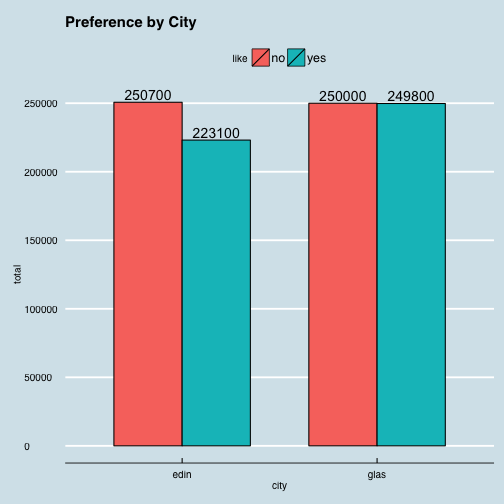
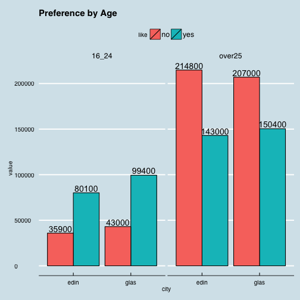
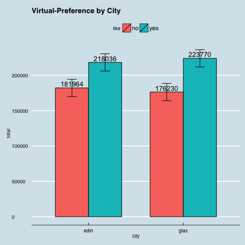

* * *
## IS607 - Week7/8
### Seoungyoon Lim(Nathan Lim)

* * *

## Table of Contents
* [Questions](#Questions)
* [Messy data](#Messy data)
* [Tidy data](#Tidy data)
* [Answering the questions](#Answering the questions)
* [New question and answer](#New question and answer)
* [Conclusion](#Conclusion)

* * *

## <a name="Questions"></a>Questions

1. Is Cullen skink generally prefered?

2. Which age group shows preference to Cullen skink? How much?

3. Which city shows preference to Cullen skink? How much?


* * *


## <a name="Messy data"></a>Messy data

```r
messy<- read.table(header=T, text="
like edin16_24  edinover25  glas16_24  glasover25
yes  80100 143000 99400 150400
no   35900 214800 43000 207000
                 ")
messy
```

```
##   like edin16_24 edinover25 glas16_24 glasover25
## 1  yes     80100     143000     99400     150400
## 2   no     35900     214800     43000     207000
```

* * *

## <a name="Tidy data"></a>Tidy data

```r
library(RColorBrewer)
library(ggthemes)
library(Hmisc)
library(tidyr)
library(dplyr)
library(ggplot2)
```

```r
tidy<-messy %>%
        gather(key, value, edin16_24:glasover25) %>%
        separate(key,c("city", "age"), 4) 

tidy
```

```
##   like city    age  value
## 1  yes edin  16_24  80100
## 2   no edin  16_24  35900
## 3  yes edin over25 143000
## 4   no edin over25 214800
## 5  yes glas  16_24  99400
## 6   no glas  16_24  43000
## 7  yes glas over25 150400
## 8   no glas over25 207000
```

* * *

## <a name="Answering the questions"></a>Answering the questions

Q1. Is Cullen skink generally prefered?


```r
general<- tidy%>%
        group_by(like)%>%
        summarise(sum=sum(value))
general
```

```
## Source: local data frame [2 x 2]
## 
##   like    sum
## 1   no 500700
## 2  yes 472900
```


As we can see above, the people who prefer Cullen skink are fewer than the people who prefer the other one. So, the answer is No by the data given. 

* * *

Q2.Which city shows preference to Cullen skink? How much?


```r
#preference by city
withoutage <- tidy%>%
        select(like,city, value)%>%
        group_by(city, like)%>%
        summarise(total=sum(value))
ggplot(withoutage, aes(x=city, y=total, ymax = max(total), fill=like)) + geom_bar(stat="identity",position="dodge",colour="black", width=0.7) +theme(strip.text.x = element_text(size=13,face="bold"))+ 
        ggtitle("Preference by City")+theme(plot.title = element_text(face="bold", size=20))+
        geom_text(aes(label=total), position=position_dodge(width=0.7), vjust=-0.25) + theme_economist()+scale_colour_economist()
```

 

As we can see above, the number of those who prefer Cullen skink is fewer in Edinburgh city. In case of Glasglow, the gap between the two groups is only 200, which is not big.

* * *

Q3. Which age group shows preference to Cullen skink? How much?


```r
#preference by age
ggplot(tidy, aes(x=city, y=value, ymax = max(value), fill=like)) + geom_bar(stat="identity", position="dodge",colour="black") + facet_grid(~ age)+ theme(strip.text.x = element_text(size=13,face="bold"))+
        ggtitle("Preference by Age")+theme(plot.title = element_text(face="bold", size=20))+
        geom_text(aes(label=value), position=position_dodge(width=0.9), vjust=-0.25) + theme_economist()+scale_colour_economist()
```

 

As we can see above, while the 16~24 aged group prefer Cullen skink, the over 25 aged group prefer the other. 


* * *


## <a name="New question and answer"></a>New question and answer

When we look the graph of 'preference by Age', we can see there is a relation between age and preference of the food. 


```r
agegroup <- tidy%>%
        select(city, age, value)%>%
        group_by(city, age)%>%
        summarise(sum=sum(value))

(pteen_edin <- agegroup$sum[1]/(agegroup$sum[1]+agegroup$sum[2]))
```

```
## [1] 0.244829
```

```r
(pteen_glas <- agegroup$sum[3]/(agegroup$sum[3]+agegroup$sum[4]))
```

```
## [1] 0.284914
```

The pecentage of 16_24 voters in Glasglow is 4 percent higer than the voters in Edinburgh. The difference of preference to Cullen skink between two cities can be explained by the numbers above. Since more teenagers did participate the poll in Glasglow, Glasglow's preference to the food is higher than Edinsburgh's.

* * *

Q4. If the same number of each groups had participated the poll, Cullen skink can be more prefered over the other one? 
Suppose each cities' voter is 400,000, so the number of Edingburgh's 16_24 aged group is 200,000.


```r
newpoll <- read.table(text="
                      city age number
                      edin 16_24 200,000
                      edin over25 200,000
                      glas 16_24 200,000
                      glas over25 200,000", header=T)

#percentage of edinburgh and 16_24 age
e1 <- tidy%>%
        filter(city=="edin", age=="16_24")%>%
        mutate(percentage=value/sum(value))

#percentage of edinburgh and over25 age
e2<- tidy%>%
        filter(city=="edin", age=="over25")%>%
        mutate(percentage=value/sum(value))

#percentage of Glasglow and 16_24 age
g1<- tidy%>%
        filter(city=="glas", age=="16_24")%>%
        mutate(percentage=value/sum(value))

#percentage of Glasglow and over25 age
g2 <- tidy%>%
        filter(city=="glas", age=="over25")%>%
        mutate(percentage=value/sum(value))


newpoll <- rbind(e1,e2,g1,g2)
newpoll$virtual <- round(newpoll$percentage*200000)
newpoll <- select(newpoll, like, city, age, virtual)
newpoll
```

```
##   like city    age virtual
## 1  yes edin  16_24  138103
## 2   no edin  16_24   61897
## 3  yes edin over25   79933
## 4   no edin over25  120067
## 5  yes glas  16_24  139607
## 6   no glas  16_24   60393
## 7  yes glas over25   84163
## 8   no glas over25  115837
```

```r
vg_city <- newpoll%>%
        select(like,city, virtual)%>%
        group_by(city, like)%>%
        summarise(total=sum(virtual))

#calculate standard error
stan_e <- function(x) sd(x)/sqrt(length(x))
se <- stan_e(vg_city$total)

ggplot(vg_city, aes(x=city, y=total, ymax = max(total), fill=like)) + 
        geom_bar(stat="identity" ,position="dodge",colour="black",width=0.7) + 
        theme_economist()+scale_colour_economist()+
        ggtitle("Virtual-Preference by City")+
        geom_text(aes(label=total), position=position_dodge(width=0.7), vjust=-0.3)+
        geom_errorbar(aes(ymin=total-se, ymax=total+se),
                  width=.2, position=position_dodge(.7))
```

 

 I did a virtual poll making the two age groups have the same number of voters. According to the virtual poll result, Cullen skint is prefered in both cities. This is against the first question's answer.


## <a name="Conclusion"></a>Conclusion
 In the above case, I cannot say which one of the answers is right since we don't know which one shows real population distributions. If the original poll's voters were randomly choosen, we could say that Cullen skint is less popular. Otherwise, we don't know the answer.
When we do polls, we should be careful at dividing groups. Results can be totally changing depending on this. 

        
